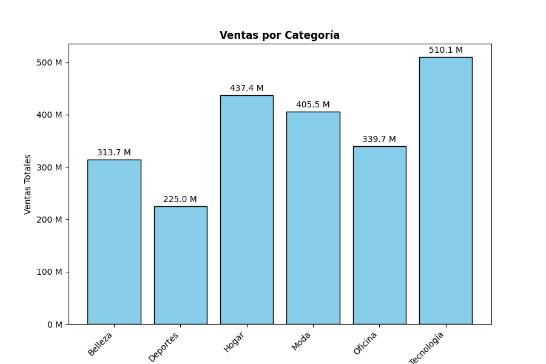
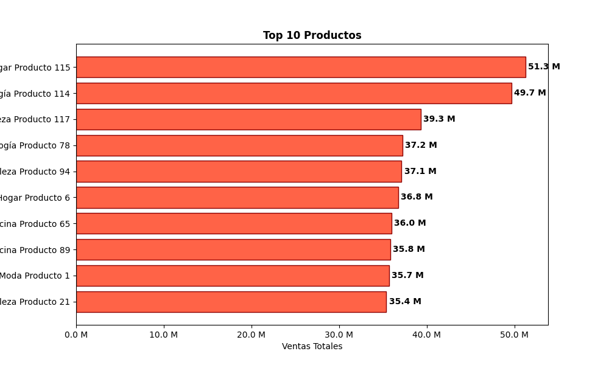
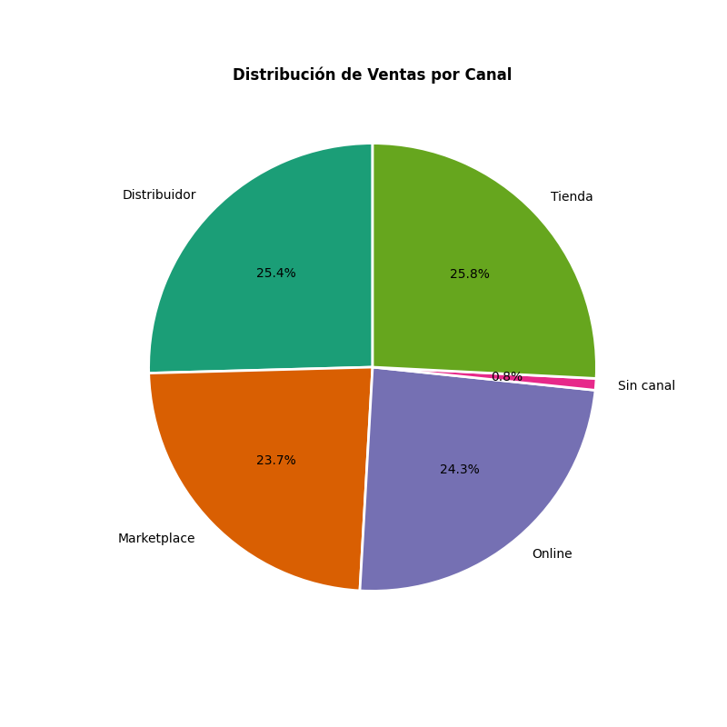
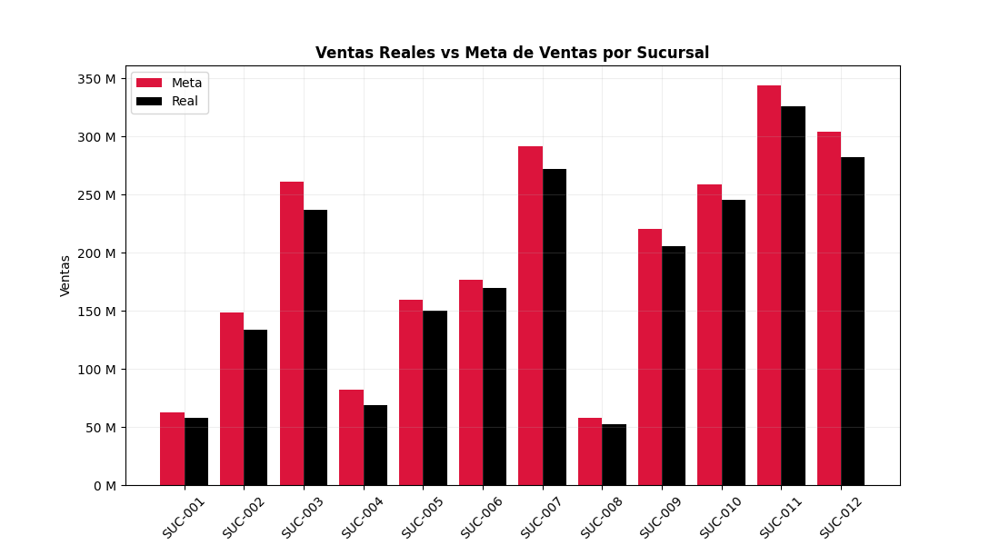

# Proyecto Final — Sistema de Análisis Comercial con Python

> Python · pandas · numpy · matplotlib · openpyxl · Google Colab

---

## 🛠️ Stack Tecnológico

| Herramienta / Librería | Uso en el proyecto |
|---|---|
| Python 3 | Lenguaje principal |
| pandas | Carga, exploración, limpieza, unificación y transformación de los 6 datasets |
| numpy | Manejo de valores nulos y condiciones numéricas |
| re (regex) | Estandarización de llaves foráneas mediante extracción de patrones |
| matplotlib | Generación de las 9 visualizaciones del proyecto |
| openpyxl | Exportación del reporte final a Excel con formato de celda (moneda, porcentaje, número) |
| Google Colab | Entorno de desarrollo (notebook interactivo) |

---

## 🎯 Objetivo

Construir un sistema de análisis comercial de extremo a extremo con Python: limpiar seis fuentes de datos independientes (ventas, clientes, productos, vendedores, sucursales y metas), unificarlas en una base analítica única, calcular KPIs y métricas de negocio, evaluar el cumplimiento de metas por sucursal, generar visualizaciones y exportar un reporte final en Excel con formato profesional — todo documentando el criterio detrás de cada decisión de limpieza e imputación.

> Los datos utilizados son ficticios / simulados con fines de aprendizaje.

---

## 📁 Estructura del Repositorio

```
📦 sistema-analisis-comercial-python/
├── 📓 Proyecto_3.ipynb                          ← Notebook con limpieza, análisis y visualizaciones
├── 📂 dataset/
│   ├── 01_ventas.xlsx
│   ├── 02_clientes.xlsx
│   ├── 03_productos.xlsx
│   ├── 04_vendedores.xlsx
│   ├── 05_sucursales.xlsx
│   └── 06_metas.xlsx
├── 📂 graficos/
│   ├── ventas_por_mes.png
│   ├── ventas_por_categoria.png
│   ├── top_10_productos.png
│   ├── top_10_vendedores.png
│   ├── ventas_por_canal.png
│   ├── utilidad_por_sucursal.png
│   ├── ventas_reales_vs_meta.png
│   └── unidades_reales_vs_meta.png
├── 📂 output/
│   ├── base_analitica_final.xlsx
│   └── reporte_final_analisis_comercial.xlsx
└── 📄 README.md
```

---

## 📦 Dataset

El proyecto integra 6 archivos fuente en un modelo de estrella (1 tabla de hechos + 5 tablas de dimensión):

| Archivo | Filas originales | Rol | Descripción |
|---|---|---|---|
| `01_ventas.xlsx` | 1,827 | Tabla de hechos | Transacciones individuales: fecha, IDs relacionados, cantidad, precio, descuento, total |
| `02_clientes.xlsx` | 406 | Dimensión | Datos del cliente: país, ciudad, segmento, estado |
| `03_productos.xlsx` | 122 | Dimensión | Catálogo de productos: categoría, marca, costo y precio de lista |
| `04_vendedores.xlsx` | 30 | Dimensión | Vendedores por sucursal y nivel |
| `05_sucursales.xlsx` | 12 | Dimensión | Sucursales: país, ciudad, zona, estado |
| `06_metas.xlsx` | 194 | Dimensión | Metas mensuales de ventas y unidades por sucursal |

**Columnas principales de la base unificada (`base`):**

| Columna | Tipo original → final | Descripción |
|---|---|---|
| VentaID / ClienteID / ProductoID / VendedorID / SucursalID | object | Identificadores (1 clave primaria reconstruida por tabla + 4 llaves foráneas estandarizadas) |
| Fecha | object → datetime | Fecha de la venta |
| Cantidad | object → int | Unidades vendidas |
| Precio_Unitario | object → float | Precio reconstruido desde el catálogo de productos |
| Descuento | object → float | Porcentaje de descuento aplicado (rango válido 0–20%) |
| Total_Venta / Venta_Neta | object → float | Monto recalculado: `Precio_Unitario × Cantidad × (1 − Descuento)` |
| Categoria, Pais_Cliente, Canal, Segmento, Zona... | object | Dimensiones de análisis, normalizadas |
| Anio, Mes, Trimestre, AnioMes | datetime → int/str | Columnas derivadas para análisis temporal |
| Venta_Bruta, Costo_Total, Utilidad, Margen | float | Métricas financieras calculadas |

---

## 🔍 EDA — Exploración Inicial

| Archivo | Dimensiones | Duplicados | Problema detectado |
|---|---|---|---|
| `06_metas` | 194 × 4 | 2 | Todas las columnas como `object`; `SucursalID`/`Fecha` con estructura por bloques a reconstruir; `Meta_Ventas`/`Meta_Unidades` con texto y outliers extremos (hasta 1,095M) |
| `05_sucursales` | 12 × 6 | 0 | 1 valor inválido `'###'` en `Zona` |
| `04_vendedores` | 30 × 5 | 0 | 1 nulo en `Nivel` |
| `03_productos` | 122 × 7 | 2 | `Categoria` con nulos + inconsistencia de mayúsculas (`tecnología`/`Tecnología`) + `'Sin dato'`; `Marca` con nulos y símbolo inválido `'###'`; `Costo_Unitario` con texto mezclado y outlier `999999999` |
| `02_clientes` | 406 × 6 | 6 | `País` (`ARGENTINA`, `méxico`), `Estado` (`ACTIVO`, `activo`) y `Ciudad` con inconsistencias de mayúsculas; `Segmento`/`Estado` con `'Sin dato'` oculto y nulos |
| `01_ventas` | 1,827 × 12 | 27 | `Cantidad` con negativos, ceros, texto (`'error'`) y outlier `999999999`; `Descuento` con texto `%`, valores fuera de rango (`150%`, `-10%`); `Canal`/`Metodo_Pago` con mayúsculas mezcladas y `'Sin dato'`; IDs con formato inconsistente (`suc-012`, `NO_EXISTE`) |

---

## 🧹 Limpieza de Datos

### Principio rector

En los tres archivos con duplicados, eliminar únicamente las **filas 100% idénticas** (`drop_duplicates()`) llevó exactamente a los conteos objetivo del proyecto — confirmando que ninguna fila debía descartarse por otros motivos: `01_ventas` 1,827→**1,800**, `02_clientes` 406→**400**, `03_productos` 122→**120**. El resto de los problemas se resolvieron **reconstruyendo o imputando**, nunca eliminando información.

### Criterios aplicados por archivo

| Archivo | Columna | Problema | Criterio aplicado |
|---|---|---|---|
| 06_metas | SucursalID / Fecha | Estructura por bloques corrupta | Reconstrucción completa: 12 sucursales × 16 meses (ene-2024 a abr-2025) |
| 06_metas | Meta_Ventas / Meta_Unidades | Texto, negativos, outliers | `pd.to_numeric(errors='coerce')` + regla IQR (`Q3+3×IQR`) para outliers + imputación con `groupby().transform('mean')` por sucursal |
| 05_sucursales | Zona | Símbolo `'###'` en sucursal inactiva | Placeholder `"Sin zona"` (no moda, por criterio de negocio: no asignar zona real a sucursal inactiva) |
| 04_vendedores | Nivel | Nulos | `.fillna("Sin nivel")` |
| 03_productos | Categoria / Producto | Nulos cruzados + inconsistencias de captura | Reconstrucción cruzada bidireccional con funciones propias (`extraer_categoria`, `reconstruir_producto`) + verificación de consistencia sobre el 100% de las filas (no solo los nulos) |
| 03_productos | Marca / Estado | Nulos + símbolo `'###'` | `.replace('###', ...)` + `.fillna("Sin marca"/"Sin estado")` |
| 03_productos | Costo_Unitario | Texto mezclado + outlier `999999999` | `pd.to_numeric(errors='coerce')` + regla IQR + imputación cruzada con ratio Costo/Precio (0.6424) calculado solo sobre filas 100% completas |
| 02_clientes | País / Ciudad / Estado / Cliente | Mayúsculas inconsistentes | `.str.title()` (aplicado antes de imputar, para no distorsionar la moda) |
| 02_clientes | Segmento / Estado | Nulos + `'Sin dato'` oculto | Placeholder (`"Sin segmento"`/`"Sin estado"`) en vez de moda, por distribución sin categoría dominante y bajo volumen de nulos |
| 01_ventas | ClienteID / ProductoID / VendedorID / SucursalID | Llaves foráneas con formato inconsistente | Función `estandarizar_id()` con regex (`re.search(r'\d+')`); sin invención de relaciones — si no reconcilia, queda `NaN` |
| 01_ventas | Fecha | 22 fechas inválidas | Se deja como `NaT` (no se imputa, para no distorsionar análisis por periodo) |
| 01_ventas | Canal / Metodo_Pago | Mayúsculas + `'Sin dato'` | `.str.title()` + placeholder (`"Sin canal"`/`"Sin método de pago"`), por distribución uniforme sin moda dominante |
| 01_ventas | Cantidad | Negativos, ceros, texto, outlier `999999999` | `pd.to_numeric` + regla IQR + imputación con mediana |
| 01_ventas | Precio_Unitario | Reconstrucción completa | Reemplazo total vía `.map()` desde `03_productos_limpio` (no reparación); huérfanos con precio promedio del catálogo |
| 01_ventas | Descuento | Texto `%`, fuera de rango | Función `parsear_descuento()` + validación de rango `[0, 0.2]`; inválidos → `0` (decisión conservadora, no promedio) |
| 01_ventas | Total_Venta | Recalculado desde cero | `Precio_Unitario × Cantidad × (1 − Descuento)` |

### Ejemplos de código clave

**Reconstrucción por bloques (SucursalID + Fecha en metas):**
```python
sucursales = [f'SUC-{i:03d}' for i in range(1, 13)]
meses = pd.date_range('2024-01-01', '2025-04-01', freq='MS')  # 16 meses

nueva_sucursal, nueva_fecha = [], []
for suc in sucursales:
    for m in meses:
        nueva_sucursal.append(suc)
        nueva_fecha.append(m)

df_metas['SucursalID'] = nueva_sucursal
df_metas['Fecha'] = nueva_fecha
```

**Detección de outliers con IQR (criterio estadístico, no arbitrario):**
```python
Q1 = df_metas['Meta_Ventas'].quantile(0.25)
Q3 = df_metas['Meta_Ventas'].quantile(0.75)
IQR = Q3 - Q1
limite_superior = Q3 + 3 * IQR
df_metas.loc[df_metas['Meta_Ventas'] > limite_superior, 'Meta_Ventas'] = np.nan
```

**Estandarización de llaves foráneas sin inventar relaciones:**
```python
def estandarizar_id(valor, prefijo, digitos):
    if pd.isna(valor):
        return np.nan
    texto = str(valor).upper().strip()
    if not texto.startswith(prefijo):
        return np.nan
    resultado = re.search(r'\d+', texto)
    if resultado is None:
        return np.nan
    numero = int(resultado.group())
    return f'{prefijo}-{numero:0{digitos}d}'
```

**Reconstrucción cruzada Producto ↔ Categoria (y verificación de consistencia):**
```python
def extraer_categoria(nombre_producto):
    categorias_validas = ['Moda', 'Hogar', 'Oficina', 'Tecnología', 'Deportes', 'Belleza']
    for categoria in categorias_validas:
        if nombre_producto.startswith(categoria):
            return categoria
    return None

# Corrige también filas que ya tenían un valor pero inconsistente con el nombre del producto
categoria_extraida = df_productos['Producto'].apply(extraer_categoria)
inconsistentes = (categoria_extraida.notna()) & (categoria_extraida != df_productos['Categoria'])
mascara_con_patron = categoria_extraida.notna()
df_productos.loc[mascara_con_patron, 'Categoria'] = categoria_extraida[mascara_con_patron]
```

**Parseo de porcentajes con validación de rango separada:**
```python
def parsear_descuento(valor):
    if pd.isna(valor):
        return np.nan
    texto = str(valor).strip()
    try:
        if '%' in texto:
            return float(texto.replace('%', '').strip()) / 100
        return float(texto)
    except ValueError:
        return np.nan

df_ventas['Descuento'] = df_ventas['Descuento'].apply(parsear_descuento)
condicion_invalida = (df_ventas['Descuento'] < 0) | (df_ventas['Descuento'] > 0.2) | (df_ventas['Descuento'].isna())
df_ventas.loc[condicion_invalida, 'Descuento'] = 0
```

---

## 🔗 Unificación y Transformación

- **Modelo de estrella:** `merge(how='left')` encadenado desde `ventas` (tabla de hechos) hacia `clientes`, `productos`, `vendedores` y `sucursales` — garantizando que las 1,800 ventas se conserven aunque alguna llave foránea no sea reconciliable.
- **Resolución de columnas duplicadas:** uso de `suffixes` para diferenciar columnas repetidas entre tablas (`Estado_producto`, `Estado_vendedor`, `SucursalID_vendedor`) y renombrado manual de `País`/`Pais` → `Pais_Cliente`/`Pais_Sucursal` al detectar que la tilde las mantenía como columnas distintas sin sufijo automático.
- **Columnas de tiempo:** `Anio`, `Mes`, `Trimestre`, `AnioMes` extraídas con el accesor `.dt`.
- **Métricas financieras:** `Venta_Bruta`, `Venta_Neta`, `Costo_Total`, `Utilidad`, `Margen` (reutilizando `Utilidad` ya calculada, evitando repetir la resta).
- **Criterio de ponderación en KPIs:** para `Margen General` y `Descuento Promedio` se usó la razón de sumas (`Utilidad.sum() / Venta_Neta.sum()`) en vez del promedio simple por fila, para que el indicador refleje la rentabilidad real del negocio y no el promedio "por transacción".

---

## 📊 Visualizaciones

| Gráfico | Tipo | Variable analizada | Hallazgo principal |
|---|---|---|---|
| Ventas por Mes, por Año | Líneas (una por año) | AnioMes vs Venta_Neta | Tendencia mensual visible en 2024 (12 meses) y 2025 (4 meses) |
| Ventas por Categoría | Barras verticales | Categoría vs Venta_Neta | **Tecnología** lidera con $510.1 M |
| Top 10 Productos | Barras horizontales | Producto vs Venta_Neta | **Hogar Producto 115** es el producto más vendido ($51.3 M) |
| Top 10 Vendedores | Barras horizontales | Vendedor vs Venta_Neta | **Valentina Torres** es la vendedora líder ($109.1 M) |
| Ventas por Canal | Gráfico de pastel | Canal vs Venta_Neta (% participación) | Los 4 canales están casi parejos (23–26%); `Sin canal` representa el 0.8% del total |
| Utilidad por Sucursal | Barras horizontales | SucursalID vs Utilidad | **SUC-011** genera la mayor utilidad ($96.7 M) |
| Ventas Reales vs Meta | Barras agrupadas | Meta_Ventas vs Venta_Real, por sucursal | Cumplimiento promedio de **93.0%** |
| Unidades Reales vs Meta | Barras agrupadas | Meta_Unidades vs Unidades_Real, por sucursal | Cumplimiento promedio de **90.12%** |






---

## ⚙️ Técnicas Python Aplicadas

- Exploración sistemática con `.shape`, `.info()`, `.duplicated()`, `.isnull().sum()`, `.unique()`, `.describe()`
- Eliminación de duplicados exactos con `.drop_duplicates()` + `.reset_index(drop=True)`
- Reconstrucción de identificadores secuenciales con f-strings y comprensión de listas (`f'PROD-{i:04d}'`)
- Reconstrucción de estructuras por bloques combinando `pd.date_range(freq='MS')` con bucles anidados
- Unificación de "vacíos disfrazados" (`"Sin dato"`, símbolos) a `NaN` real con `.replace()`
- Conversión robusta a numérico con `pd.to_numeric(errors='coerce')`
- Detección de outliers con la regla del rango intercuartílico (`Q1`, `Q3`, `IQR`, `Q3 + 3×IQR`) en vez de umbrales arbitrarios
- Imputación contextual con `groupby().transform('mean')` (promedio por grupo, no promedio general)
- Extracción de patrones de texto con expresiones regulares (`re.search(r'\d+')`)
- Funciones propias con manejo de casos límite (`extraer_categoria`, `reconstruir_producto`, `estandarizar_id`, `parsear_descuento`) aplicadas con `.apply()` (incluyendo `axis=1` para funciones que requieren varias columnas de una misma fila)
- Verificación de consistencia cruzada entre columnas relacionadas, más allá de solo completar nulos
- Mapeo de valores entre tablas con `.map()` sobre una Serie indexada (`set_index()`), como alternativa ligera a `merge()` para traer una sola columna
- Unificación de tablas con `merge(how='left')` encadenado, manejo de columnas duplicadas con `suffixes`
- Creación de columnas de tiempo con el accesor `.dt` (`.dt.year`, `.dt.month`, `.dt.quarter`, `.dt.strftime`)
- Agregación con `.groupby().agg()` con múltiples métricas nombradas
- Gráficos con `ax.bar()`, `ax.barh()`, `ax.plot()`, `ax.pie()`, incluyendo barras agrupadas con desplazamiento manual (`x - ancho/2`, `x + ancho/2`)
- Formato de ejes con `matplotlib.ticker.FuncFormatter` y etiquetas de valor con `ax.bar_label()`
- Exportación multi-hoja con `pd.ExcelWriter(engine='openpyxl')`
- Formato de celda (moneda, porcentaje, número) aplicado por contenido (no por posición fija) con `openpyxl` y `cell.number_format`

---

## 📋 Resultados & Hallazgos Clave

| Métrica | Valor |
|---|---|
| Ventas Totales | $2,238,818,000 |
| Utilidad Total | $672,121,900 |
| Margen General (ponderado) | 30.02% |
| Cantidad Vendida | 8,073 unidades |
| Número de Ventas | 1,800 |
| Ticket Promedio | $1,243,788 |
| Descuento Promedio (ponderado) | 8.28% |
| Cumplimiento promedio de Ventas | 93.0% |
| Cumplimiento promedio de Unidades | 90.12% |
| Categoría líder | Tecnología ($510.1 M) |
| Producto líder | Hogar Producto 115 ($51.3 M) |
| Vendedor líder | Valentina Torres ($109.1 M) |
| Sucursal con mayor utilidad | SUC-011 ($96.7 M) |

---

## 🧠 Conclusiones y Aprendizajes

### Sobre la calidad de los datos
Los 6 archivos presentaron una combinación deliberada de errores típicos de un entorno real: duplicados exactos, IDs corruptos o con formato inconsistente, texto con mayúsculas mezcladas, valores fuera de rango, outliers extremos (placeholders tipo `999999999`) y estructuras completas que había que reconstruir desde cero (como `SucursalID`/`Fecha` en `06_metas`). El criterio central del proyecto fue **no perder información innecesariamente**: se eliminaron únicamente filas 100% duplicadas, y todo lo demás se resolvió mediante reconstrucción lógica o imputación justificada.

### Sobre las decisiones de imputación
No todas las columnas se trataron igual. Para columnas categóricas sin una base estadística sólida (`Zona`, `Segmento`, `Canal`), se prefirió un placeholder explícito (`"Sin dato"`, `"Sin canal"`) en vez de la moda, evitando inventar una tendencia que los datos no respaldaban. Para columnas numéricas con relación de negocio conocida (`Costo_Unitario`/`Precio_Lista`), se usó una imputación cruzada basada en el ratio real del catálogo. Y para KPIs generales (`Margen General`, `Descuento Promedio`), se usó el criterio ponderado por monto en vez del promedio simple, porque representa mejor la rentabilidad real del negocio en su conjunto.

### Sobre la retroalimentación recibida
Una revisión externa detectó dos puntos que el primer paso de limpieza no cubría: (1) la reconstrucción cruzada de `Categoria` solo se aplicó a los nulos, sin verificar si las filas que **ya tenían un valor** eran consistentes con el patrón del nombre del producto; y (2) el símbolo inválido `'###'` en `Marca` se detectó durante la exploración pero no se corrigió en la limpieza final. Ambos se corrigieron agregando una verificación de consistencia sobre el 100% de las filas (no solo los nulos) y completando el reemplazo de símbolos inválidos que ya se habían identificado. Esta experiencia reforzó una lección clave: **detectar un problema en el EDA no garantiza que quede resuelto en el código final** — cada hallazgo de la exploración debe tener su línea de código correspondiente en la limpieza, y conviene una verificación final que confirme que ningún hallazgo quedó "solo documentado".

### Sobre la limitación metodológica de las llaves foráneas
Al estandarizar `ClienteID`, `ProductoID`, `VendedorID` y `SucursalID` en `01_ventas`, se decidió **no inventar relaciones**: los valores no reconciliables (tipo `NO_EXISTE`) se dejaron como `NaN` en vez de asignarlos a una entidad arbitraria. Esto es correcto desde el punto de vista de integridad de datos, pero tiene una consecuencia real en el análisis: en el cálculo de cumplimiento de metas, la sucursal `SUC-001` mostró 0% de ventas reales en septiembre de 2024, un resultado que podría estar subestimado si alguna de las 11 ventas con `SucursalID` no reconciliable perteneciera en realidad a esa combinación sucursal-mes. Esta es una limitación conocida y documentada del análisis, no un error oculto: el cumplimiento de metas podría estar levemente subestimado en los casos donde existan llaves foráneas no reconciliables.

### Aprendizajes técnicos clave
- La regla del rango intercuartílico (`Q3 + 3×IQR`) es un criterio estadístico defendible para detectar outliers, más robusto que fijar un umbral arbitrario
- `groupby().transform()` permite imputar con el promedio *del propio grupo* (por ejemplo, por sucursal), a diferencia de `groupby().mean()` que solo genera una tabla resumen
- Al usar `merge()`, solo la columna definida en `on=` se fusiona automáticamente; cualquier otra columna repetida entre tablas requiere `suffixes` explícitos para no perder claridad
- `.map()` sobre una Serie indexada (`set_index()`) es una alternativa más ligera que `merge()` cuando solo se necesita traer una columna desde otra tabla
- Un promedio ponderado (`suma total / suma total`) representa mejor una métrica de negocio agregada que el promedio simple de una columna ya calculada por fila
- El formato de celda en Excel (`number_format` de `openpyxl`) es puramente visual: nunca debe reemplazar el valor numérico real del DataFrame, para no perder la capacidad de seguir calculando sobre esos datos
- Un valor de porcentaje ya multiplicado por 100 en el DataFrame requiere el formato `'0.00"%"'` (símbolo literal) en vez de `'0.00%'` (que multiplica de nuevo por 100 en Excel)
- Verificar la consistencia de una columna en el 100% de las filas — no solo en los nulos — evita dar por resuelto un problema que en realidad solo se ocultó parcialmente

---

*Proyecto desarrollado como parte del portafolio de análisis de datos.*
